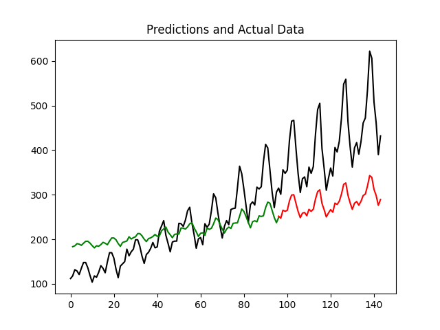

# LSTM_Keras

"The Long Short-Term Memory network, or LSTM network, is a recurrent neural network trained using Backpropagation Through Time that overcomes the vanishing gradient problem." 

## Regression

LSTM model for regression problems with data from airline customers over time.

